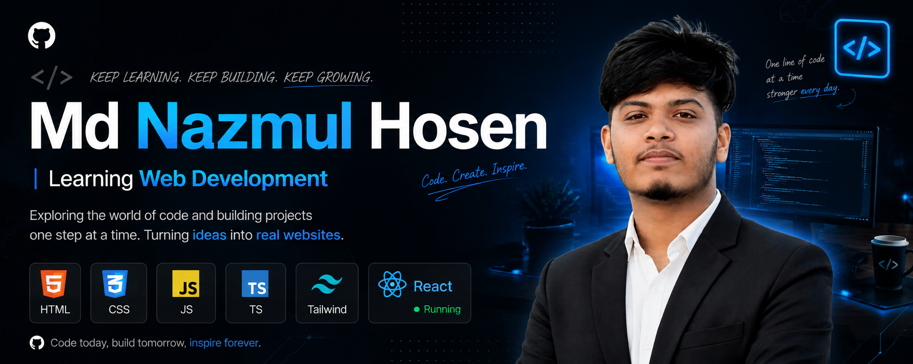

<p align="center">
  
</p>

<p align="center">
  
</p>

<h3 align="center">💻 Learning Web Development | Building Projects | Improving Every Day</h3>

<p align="center">
  <a href="https://github.com/">
    
  </a>
  
</p>

---

## 🚀 About Me

- 🌱 I'm currently learning **Web Development**
- 💻 Learning and practicing **HTML, CSS, JavaScript, TypeScript, Tailwind CSS & React**
- ⚛️ Currently focusing on **React**
- 🛠️ I enjoy building projects and turning ideas into real websites
- 📚 Always learning something new and improving my coding skills
- 🎯 Goal: Become a strong **Software Engineer**

---

## 🧑‍💻 Tech Stack

### 🌐 Frontend

<p>
  
</p>

### 🔧 Tools

<p>
  
</p>

---

## 📊 My GitHub Stats

<p align="center">
  
  
</p>

---

## 🔥 Current Focus

```text
HTML          ████████████████████  100%
CSS           ████████████████████  100%
JavaScript    ██████████████████░░   90%
TypeScript    ███████████████░░░░░   75%
Tailwind CSS  ████████████████░░░░   80%
React         ████████████░░░░░░░░   Learning
```

---

## 🎯 Learning Roadmap

- [x] HTML
- [x] CSS
- [x] JavaScript Fundamentals
- [x] TypeScript Fundamentals
- [x] Tailwind CSS
- [ ] React — Learning 🚀
- [ ] Node.js
- [ ] Express.js
- [ ] MongoDB
- [ ] Full-Stack Development

---

## 💡 What I Believe

> **"Code today. Build tomorrow. Inspire forever."**

I believe consistency beats perfection.  
Every line of code is a step toward becoming a better developer. 🚀

---

## 📫 Connect With Me

<p>
  <a href="https://github.com/nazmul-07">
    
  </a>
  <a href="https://www.linkedin.com/">
    
  </a>
</p>

---

<p align="center">
  <b>⭐ Thanks for visiting my profile!</b>
  <br/>
  <sub>Keep learning • Keep building • Keep growing 🚀</sub>
</p>
